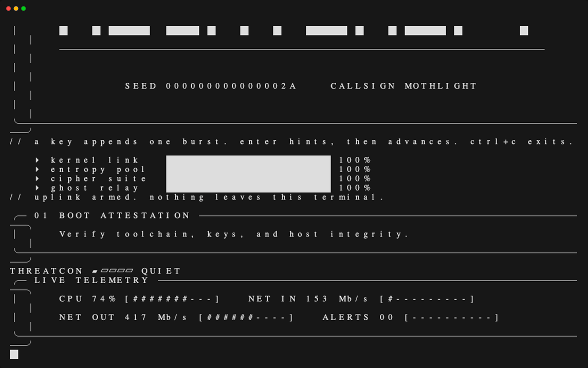

# NIGHTSHIFT

<p align="center">
  <strong>Offline tactical operations console for your terminal.</strong><br>
  A cinematic, fictional incident-response shift with no network access and no real system effects.
</p>

<p align="center">
  
</p>

NIGHTSHIFT is a local terminal simulation built for atmosphere: five scripted phases, realistic-looking console output, a seeded world map, radio chatter, live telemetry, and a final handoff card. Everything is fictional and generated locally. Hosts use `.invalid` names, addresses come from documentation ranges, and no commands are executed against your machine.

## Quick start

```sh
go install github.com/rlwillen0121/nightshift/cmd/nightshift@latest
nightshift
```

From a checkout:

```sh
go run ./cmd/nightshift
```

For a stable, screenshot-friendly run:

```sh
go run ./cmd/nightshift --seed 42 --ascii --no-color --reduced-motion
```

Run `nightshift --help` for all options.

## How to play

- Press any printable key to append one burst for the current phase.
- Press **Enter** after a burst to advance to the next phase.
- Press **Enter** before a burst to show the phase hint.
- Press **Ctrl+C** to exit.

A complete shift moves through Boot, Signal, Correlation, Containment, and Report. The final Enter prints a debrief with commands, hosts, alerts, elapsed shift time, and a mock handoff grade. Output remains in terminal scrollback; NIGHTSHIFT never uses the alternate screen.

## What changes between runs

The simulation uses a seeded pseudo-random generator. Pass `--seed 42` to reproduce the same callsign, transcript, route, timings, and visual choices. Without `--seed`, the local clock supplies a new seed and the header prints it. Your own pauses still affect the reported shift time.

The console includes:

- animated phase banners, loaders, waveform, threat meter, and telemetry;
- fictional scans, packet captures, DNS answers, logs, process lists, firewall actions, and sealed reports;
- an ASCII world map that draws traceroute hops such as IAD, FRA, DXB, HKG, and SIN;
- occasional analyst radio chatter and rare self-healing status glitches;
- optional ASCII-only output, reduced motion, no color, and terminal bells for warning lines.

## Safety by design

NIGHTSHIFT is deliberately self-contained. It makes no network requests, reads no mission file, and does not inspect or change the host system. Invalid arguments exit with a sanitized message, and non-interactive stdin/stdout is rejected with `interactive terminal required`.

## License

Released under the [MIT License](LICENSE).
