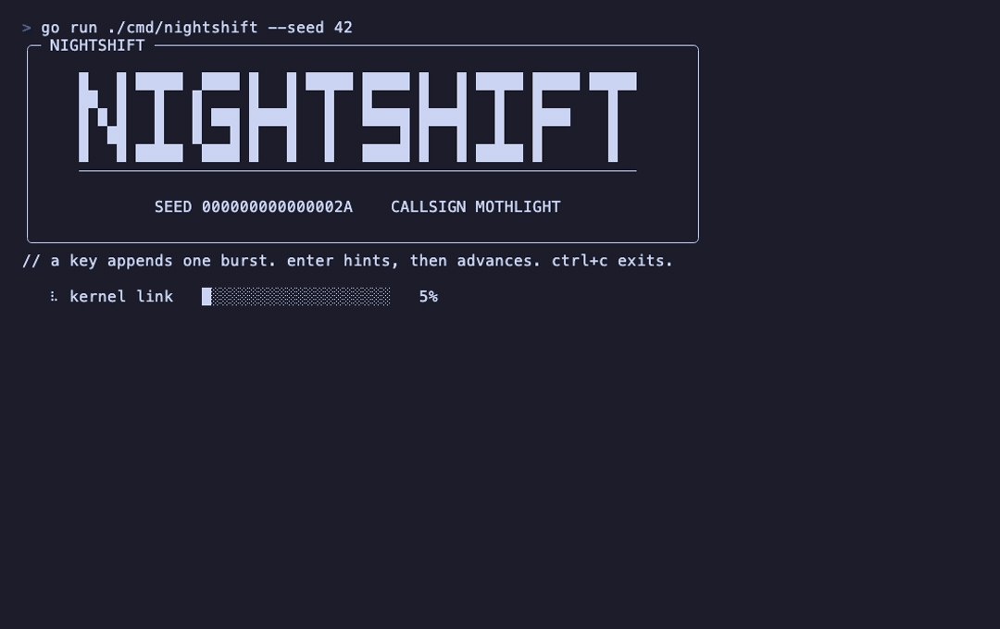

# NIGHTSHIFT

<p align="center">
  <strong>Offline tactical operations for your terminal.</strong><br>
  A fictional incident response shift with animated telemetry, signal analysis, and a world spanning traceroute.
</p>

<p align="center">
  
</p>

NIGHTSHIFT is a local terminal simulation written in Go. It turns a few keystrokes into a cinematic five phase shift: verify the host, follow a signal, correlate evidence, contain the incident, and close the handoff. The output is generated locally and stays fictional from start to finish.

## Start a shift

Install the command:

```sh
go install github.com/rlwillen0121/nightshift/cmd/nightshift@latest
nightshift
```

Or run it from a checkout:

```sh
go run ./cmd/nightshift
```

For a repeatable, screenshot friendly run:

```sh
go run ./cmd/nightshift --seed 42 --ascii --no-color --reduced-motion
```

Use `nightshift --help` to see the available flags.

## Controls

| Key | Action |
| --- | --- |
| Any printable key | Append one burst for the current phase |
| Enter after a burst | Advance to the next phase |
| Enter before a burst | Show the current phase hint |
| Ctrl+C | Exit the shift |

A complete shift moves through **Boot**, **Signal**, **Correlation**, **Containment**, and **Report**. The final Enter prints a debrief card with command, host, alert, and shift time counts plus a mock handoff grade. The transcript remains in scrollback, so the story keeps its history while the telemetry panel and map update in place.

## What you will see

- Phase banners with loaders, a settling signal waveform, a threat meter, and live telemetry.
- Fictional port scans, packet captures, DNS answers, auth logs, process lists, firewall actions, and sealed reports.
- An ASCII world map that traces hops through cities such as IAD, FRA, DXB, HKG, and SIN with made up latency.
- Short radio messages from other analysts and occasional status glitches that resolve themselves.
- A final stats card that closes the shift with a clean handoff.

## Repeatable runs

NIGHTSHIFT uses a seeded pseudo random generator. `--seed 42` reproduces the same callsign, transcript, route, timings, and visual choices. Without a seed, the local clock supplies one and prints it in the header. The content is repeatable with a seed; the reported shift time still includes the time you spend thinking between keystrokes.

Color and motion are optional:

- `--ascii` uses ASCII artwork.
- `--no-color` disables color.
- `--reduced-motion` shortens loaders and animated transitions.
- `--bell` rings the terminal bell when a warning line appears.
- `NO_COLOR` and `TERM=dumb` are respected; `TERM=dumb` also selects ASCII and reduced motion.

## Safety

NIGHTSHIFT makes no network requests, reads no mission file, and does not inspect or change the host system. Hosts use `.invalid` names, addresses come from documentation ranges, and finding IDs are invented. Keystrokes are not echoed or stored. Invalid arguments exit with a sanitized message, and non interactive input exits with `interactive terminal required`.

## License

[MIT](LICENSE)
